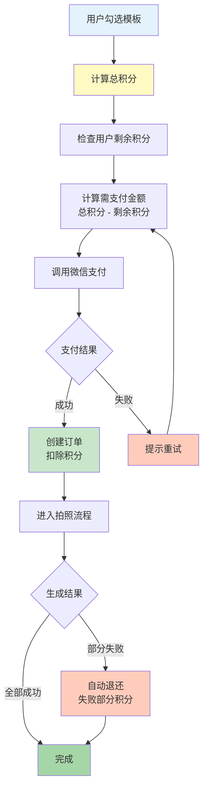

# AI旅拍小程序 - 前端功能梳理

## 1. 页面总览

| 页面编号 | 页面名称 | 功能描述 |
|---------|---------|---------|
| P0 | 欢迎页 | 中转路由页，判断用户进入方式和状态 |
| P1 | 通用模板选择页 | 首次用户免费体验入口，展示7种单人照人群类型模板 |
| P2 | 模板详情页 | 全屏显示模板图片，触发拍照授权 |
| P3 | 拍照页 | 用户自拍，支持缓存上次自拍照 |
| P4 | 权限提醒页 | 位置/摄像头/相册权限的二次授权提醒 |
| P5 | 照片生成加载等待页 | 照片生成等待加载状态，显示进度，支持单照片和多照片生成UI样态 |
| P6 | 照片生成结果页 | 返回照片结果后，显示照片结果，支持单张或多张照片查看 |
| P7 | 照片生成失败页 | 照片生成失败，显示失败原因，支持单张或多张照片查看 |
| P8 | 付费模板选择页 | 老用户入口，支持多选模板和更多模板类型和景点模板选择 |
| P9 | 分享好友详情页 | 好友分享照片/模板的着陆页 |
| P10 | 我的照片页 | 用户历史照片列表 |
| P11 | 合照对象拍照页 | 合照场景的远程协作拍照 |

---

## 2. 页面跳转流程

```
[用户入口] --> P0欢迎页判断
  |-- 首次用户（未消耗赠送积分）--> P1 --> P2 --> P3 --> P5 --> P6
  |-- 老用户（已消耗赠送积分）--> P8 --> P3 --> P5 --> P6
  |-- 好友分享照片/模板 --> P9 --> P3 --> P5 --> P6
```

### 用户身份判断标准

**"消耗过赠送积分"的精确定义**：仅指用户是否消耗过注册时系统赠送的那10个积分（或渠道自定义的赠送积分）。

**判断逻辑**：
- 用户注册时：`initial_free_credits = 10`（或渠道配置值）
- 首次生成照片成功后：`has_used_free_credits = TRUE`

**P0跳转判断**：
```
IF has_used_free_credits = FALSE → 跳转P1（首次用户）
ELSE → 跳转P8（老用户）
```

**注意**：该标志一旦设为TRUE，永不回退。即使用户后续获得推荐奖励积分，仍视为"老用户"。

---

## 3. 功能分页面详情

### P0：欢迎页

#### 业务逻辑

1. **中转路由页**：主要用于判断用户进入方式，并定义用户跳转目标页面，1秒内即跳转
2. **呈现项目IP形象**：可由后台配置
3. **用户登录判断**：
   - **(1) 用户进入方式**
     - 点击好友分享的小程序卡片
     - 点击好友分享的好友照片结果页（即从P6分享出来的）
     - 点击好友分享的模板详情页（即从P2分享出来的）
     - 用户扫描小程序二维码（线下）
     - 用户点击推广员在企微里发送的小程序卡片
     - 用户在微信搜索框搜索添加
   - **(2) 用户是否有消耗过1次赠送积分**

#### 跳转逻辑

P0作为中转路由页，按以下优先级顺序判断跳转目标：

##### 第一优先级：检查未完成订单（生成中断恢复）

用户进入P0时，首先调用接口检查是否有未完成的订单：
```
GET /api/v1/mp/orders/pending
```

| 订单状态 | 跳转目标 | 说明 |
|---------|---------|------|
| generating (生成中) | P5生成加载等待页 | 反复生成/逐帧显示,通过WebSocket实时推送最新状态 |
| pending_payment (待支付) | P8付费模板选择页 | 继续提示"您有待付订单",可选择继续付款/取消 |
| 无未完成订单 | 继续下一步判断 | - |

##### 第二优先级：判断进入方式

**当用户进入方式为以下任一种时：**
- 用户扫描小程序二维码
- 用户点击推广员在企微里发送的小程序卡片
- 用户在微信搜索框搜索添加
- 点击好友分享的小程序卡片

**则：**
- 未消耗过赠送积分：跳转P1（通用模板选择页）
- 消耗过1次及以上赠送积分：跳转P8（付费模板选择页）

**当用户进入方式为以下任一种时：**
- 点击好友分享的好友照片结果页（即从P6照片生成结果页）
- 点击好友分享的模板详情页（即从P2模板详情页）

**则：**
- 跳转P9分享好友详情页，执行P9后续流程

#### 生成中断恢复流程图

```
用户退出小程序（生成过程中）
         ↓
    后端任务继续执行（不中断）
         ↓
    用户重新打开小程序
         ↓
    进入P0欢迎页
         ↓
    调用 /api/v1/mp/orders/pending
         ↓
    ┌────┴────┐
    ↓         ↓
 有生成中订单  无未完成订单
    ↓         ↓
 自动跳转P5   继续正常判断流程
    ↓
 建立WebSocket连接
    ↓
 恢复进度显示（已完成的照片直接显示，未完成的继续等待）
```

---

### P1：通用模板选择页

#### 交互逻辑

- **滚动交互**：
  - 用户上下滑动，查看当前人群类型下所有模板，滑动时右边垂直滚动条显示，不滑动时滚动条消失
  - 滚动区域仅限于[中间主体：瀑布流模板列表]

- **切换交互**：
  - 用户左右滑动，可切换人群类型，选中人群类型字体样态随之变化
  - 左右滑动的区域范围包括[顶部2：人群类型标签栏]和[中间主体：瀑布流式模板列表]

- **首次点选模板触发位置授权**：
  - 用户点击模板：**立即跳转P2**（零等待，位置授权完全在后台异步处理）
  - 位置授权弹窗可能在P2页面显示，不影响用户体验
  - 用户确认授权位置：后台异步获取GPS位置并保存
  - 用户拒绝授权位置：不再打扰用户，允许继续使用
  - **性能优化**：
    - 完全异步化：用户点击后立即跳转，无需等待任何授权操作
    - 双重防护：内存标志 + Storage标志，防止多次弹出授权框
    - 位置信息获取（GPS定位）在后台异步完成

---

### P2：模板详情页

#### 交互逻辑

1. **返回**：点击左上角返回按钮，返回P1通用模板选择页

2. **拍照授权**：
   - 点击"拍照"后，**快速检查**摄像头权限状态
   - 如果"之前拒绝"过：跳转P4权限提醒页，引导用户去设置开启
   - 如果未拒绝过（首次或已授权）：**直接进入P3拍照页**，让 camera 组件自己处理授权
   - **性能优化**：
     - 消除重复授权：不在P2调用 `wx.authorize()`，只让 camera 组件弹一次授权框
     - 减少等待时间：用户点击后更快进入P3

3. **用户所拍照片保存数据库**，用户执行AI换脸可随时调用

#### 页面布局及交互

**拍照后**：
- 底部拍照按钮隐藏，切换为[确认]和[重拍]按钮
- 用户点击[重拍]后重新拍照
- 用户点击[确认]后：
  - 单照片则进入P5单照片生成页
  - 多照片则进入P5多照片生成页
  - 原始照片不存入用户相册
  - 所有已拍正脸照缓存本地手机，下次启动默认显示已拍照片
  - 重新拍摄照片则更新本机缓存及后台服务器
- 返回：点击左上角"返回"按钮，哪里进入P3则回到哪里
- 调用 `wx.compressImage`，限制上传图片原图大于 2MB 时强制压缩至 1000px以内，且文件大小控制在 1MB 以内

---

### P4：权限及故障提醒页

#### 业务逻辑

1. 完成位置权限授权必要性提醒
2. 完成摄像头权限授权必要性提醒
3. 完成相册权限授权必要性提醒

#### 页面布局及功能描述

##### 1. 二次位置授权提醒

当用户在首次授权界面点击取消，或在需要授权才能使用服务的相关界面操作时：
- 弹出IP手持标牌提醒字样图片弹窗+音频播报（内置小程序）
- 上浮[继续授权开启位置]按钮
- 点击[继续授权开启位置]按钮，跳转小程序权限设置界面
- 点击权限设置界面的[返回]图标，则直接返回P1
- 当用户点击左上角[返回]，则跳转P1

##### 2. 二次摄像头授权提醒

当用户在首次授权界面点击取消或在需要授权才能使用服务的相关界面操作时：
- 弹出IP手持标牌提醒字样图片弹窗+音频播报（内置小程序）
- 上浮[继续授权开启摄像头]按钮
- 用户点击该按钮，则跳转权限设置界面，用户自行配置
- 用户在权限设置界面点击返回按钮，则直接跳转P3拍照页
- 当用户点击左上角[返回]，则跳转P2

##### 3. 二次保存相册授权提醒

当用户在首次授权界面点击取消或在需要授权才能使用服务的相关界面操作时：
- 弹出IP手持标牌提醒字样图片弹窗+音频播报（内置小程序）
- 上浮[继续授权保存相册]按钮
- 用户点击该按钮，则跳转权限设置界面，用户自行配置
- 用户在权限设置界面点击返回按钮，则直接跳转P4的上级界面
- 当用户点击左上角[返回]，则跳转上级界面

---

### P5：照片生成加载等待页

#### 业务逻辑

##### 从P3拍照页开始的执行流程

当用户在P3拍照页点击[确认]后，进入P5生成加载等待页面：

**情况1**：当用户所选模板为以下人群类型代码时：
- `girl_child`, `boy_child`
- 合照：`couple_love`, `friends_girls`, `friends_boys`, `friends_mixed`, `mom_son_child`, `mom_son_adult`, `mom_daughter_child`, `mom_daughter_adult`, `dad_son_child`, `dad_son_adult`, `dad_daughter_child`, `dad_daughter_adult`

**处理逻辑**：
- 模板只有一个版本
- 用户自拍照和模板直接上传AI换脸工作流执行AI换脸
- 用户自拍照同步上传AI用户判别工作流
- AI用户判别工作流返回结果后，程序在后台将结果数据永久存入数据库，以备后续程序再次读取和执行相关功能

**情况2**：当用户所选模板为以下五种人群类型代码时：
- `girl_young`, `woman_mature`, `woman_elder`, `man_young`, `man_elder`

**处理逻辑**：
- 模板拥有宽脸和窄脸两个版本
- 用户自拍照先上传至AI用户判别工作流，等待返回结果
- 返回结果永久存入数据库中
- 程序根据返回的脸型值，匹配所选模板的脸型版本
  - 返回值为窄脸 → 调用窄脸模板执行AI换脸流程
  - 返回值为宽脸 → 调用宽脸模板执行AI换脸流程

##### 从P8付费模板选择页开始的执行流程

当用户在P8付费模板选择页选择好模板，点击[拍照留念]按钮后，程序根据用户所选人群类型、模板标签属性、数据库中的自拍照和AI用户判别的结果参数，执行不同的逻辑：

**情况1**：模板为 `girl_young`, `woman_mature`, `woman_elder`, `man_young`, `man_elder` 五种人群类型代码时：
- 模板拥有宽脸和窄脸两个版本
- 程序根据数据库中AI用户判别的脸型结果参数，调用不同的模板
- 用户脸型为宽脸 → 调用宽脸模板
- 用户脸型为窄脸 → 调用窄脸模板
- 连同用户自拍照一起上传至AI换脸工作流，执行AI换脸流程

**情况2**：模板为 `girl_child`, `boy_child` 及合照类型时：
- 模板只有一个版本
- 程序直接调用该模板
- 上传该模板和用户自拍照至AI换脸工作流，执行AI换脸流程

#### AI Coze 工作流集成说明

1. **异步处理**：后端采用轮询 (Polling) 方式获取 Coze 生成结果，轮询频率为 1 秒/次，单次任务超时时间设为 30 秒
2. **状态同步**：后端获取结果后通过 WebSocket 实时推送到前端

#### 加载等待过程UI设计说明

1. **全屏虚化模糊显示**用户选择的模板图片
   - 单张模板则显示该模板图片
   - 多张模板则**以每3秒的速度进行轮播**显示模板
   - 所有模板呈现虚化模糊效果

2. **顶部进度信息** - 倒计时胶囊显示 "还剩30秒"
   - 倒计时逻辑：
     - 3张照片 = 15秒总时长，每张5秒
     - 5张照片 = 25秒总时长，每张5秒
     - 依此类推

3. **中间微信系统默认加载进度条**，进度条下方显示"正在生成第1/5张"
   - 超时或生成失败则进度条变成[重试]按钮
   - 点击[重试]按钮，重新执行AI换脸流程

4. **底部中间位置**：IP图标形象＋气泡说话框，气泡说话框里随机显示以下话术：
   - "宝子，再等会,你的照片马上就到你手机里啦！"
   - "看小姐姐五官清秀，让我猜猜看，小姐姐是湖南的吧？"
   - "我刚刚用AI颜值测评器测了下你的颜值，评分很高哎95分，已经超过全长沙98%的人了!"

---

### P6：照片生成结果页

#### 页面布局

1. **顶部**：返回按钮 "< 返回"

2. **中间主体展示结果照片**
   - 单张则全屏显示
   - 多张则以全屏展示,显示左右箭头,可以左右滑动
   - 先返回结果的照片先展示，后返回结果的照片排在后面

3. **左右滑动箭头**（多张结果图时显示）
   - 首张图：右侧显示向右滑动箭头 `>`
   - 中间图：左右两侧都显示箭头 `<` `>`
   - 最后一张：左侧显示向左滑动箭头 `<`
   - **箭头显示逻辑**：
     - 页面加载时箭头显示3秒后自动消失
     - 用户滑动切换图片时箭头重新显示3秒后消失
     - 箭头样式为白色半透明，位于图片左右两侧垂直居中位置

4. **底部导航栏**：IP头像、保存相册、再来一张、分享好友

#### 交互逻辑

##### 保存相册
- 未授权新用户点击[保存相册]则调起相册授权权限
- 用户已授权则直接保存相册
- 用户曾取消授权则跳转P4，引导用户手动设置开启相册保存权限

##### 再来一张
- **已授权位置权限用户**点击[再来一张]或左上角[返回]按钮：
  - 跳转P8付费模板选择页
  - 后台计算离用户最近距离的景点并推荐该景点的模板列表
  - 读取存入的AI用户判别工作流结果参数中用户所属人群类型
  - 根据用户所属人群类型，推荐该人群类型的模板列表

- **未授权位置权限用户**点击[再来一张]或左上角[返回]按钮：
  - 同样跳转P8付费模板选择页
  - 直接调用全国通用版模板列表
  - 读取存入的AI用户判别工作流结果参数中用户所属人群类型
  - 根据用户所属人群类型，推荐该人群类型的模板列表

##### 分享好友
- 用户点击[分享好友]或系统按钮分享好友，则转发当前生成效果图小程序卡片给到微信好友
- **好友端接收**：小程序卡片呈现（后台可配置）
  - 动态标题：给你看看我在橘子洲拍的美照（标题根据用户模板背景所在地进行调整）
  - 封面：用户效果图（以效果图横向中心线为基准，按小程序卡片标准尺寸截取呈现效果图）
- 好友点击分享的小程序卡片后，进入P9分享好友详情
- 分享成功后显示'分享成功'toast提示

---

### P8：付费模板选择页

#### 业务逻辑

1. **入口逻辑**：所有已消耗过赠送积分的用户均由欢迎页直接跳转该页
   - 根据已知的用户位置信息（线下带位置参数的小程序码或链接）、人群类型，推荐进入对应的默认模板列表
   - 若为线上用户且未授权位置信息，则默认进入全国通用的付费模板列表

2. **模板选择**：用户通过点选（多选）选择模板，付费生成
   - 勾选模板后，系统自动预加载模板原图到本地以提升后续显示速度

3. **支付逻辑**：
   - 采用积分兑换人民币的方式购买照片生成服务，1个积分=1元人民币
   - 若订单金额被积分完全抵扣（需支付现金为 0 元），后端直接标记订单为'支付成功'并进入生成流程，无需调用微信支付接口
   - 在实际支付完毕后，后台需要将实际支付的金额计入到渠道商业绩

4. **用户激励机制**：
   - 每个未付费用户默认赠送10个积分（可在渠道配置中自定义）
   - 全系统的照片以积分的方式统一定价，具体由后台进行配置（0-15积分）
   - 用户的任何推荐行为引进来的付费用户，每增加一个付费用户（不管支付多少钱，每人只计算一次）获得1个积分
   - 用户支付时优先使用积分，不足部分支付现金
   - 用户再次进来，弹窗提示还有多少积分

5. **支付方式**：积分+现金
   - 用户在支付界面上的金额，优先使用其全部积分进行抵扣，剩余部分用现金支付
   - 示例：您共消耗积分30，剩余积分已抵扣10元，还需要支付20元

6. 用户通过该页查看[我的照片]历史照片页

#### 页面布局

1. **系统栏**
   - 左上角"我的照片"按钮
   - 右上角小程序的系统按钮区

2. **筛选栏**：景点、人群类型
   - 景点：默认后台计算的距离用户最近的景点名，点击进入更多景点选择列表
   - 人群类型：默认数据库中用户所属的人群类型（即AI用户判别工作流结果参数中关于人群类型参数），点击进入更多人群类型选择列表
   - 景点和人群类型名字字数不超过四个字，超过则第四个字省略，采用隐藏方式

3. **中间主体**：模板列表
   - 模板缩略图右下角带勾选框，用户勾选热区为模版底边和右边中心点连成的三角区域
   - 以左右两列瀑布流形式不断往下刷

4. **底部导航栏**：IP头像、购物车、"拍照留念"支付按钮

#### 交互逻辑

- **进入界面时初始状态**：底部导航栏隐藏
- 当用户勾选1个或多个模板，底部导航栏显示
- 当用户去选所有模板（即模板选择数为0）时，底部导航栏隐藏
- 用户勾选模板状态下：
  - 当用户往下滑动（包括滑动到底），顶部筛选栏消失
  - 当用户往上滑动（包括滑动到顶），顶部筛选栏出现，底部导航栏隐藏

- **切换人群类型**：
  - 当切换到另一人群类型，则已选模板清零
  - 首次使用发起弹窗提醒"切换后已选模板将清零"，后续使用不再提醒

- **勾选模板**：
  - 用户点击模板缩略图右下角的勾选框（右下角较大的三角区以加强勾选的敏感度，右边框和底边框中点连线组成的三角区）视为勾选动作
  - 单击勾选/再击去选，同步更新底下的购物车（数量、金额）

- **查看大图**：
  - 用户点击模板缩略图的非勾选区时，模板跳出小程序全屏显示（系统功能）
  - 双指放大查看细节
  - 长按分享好友或保存相册（采用系统自有图片处理方式）
  - 再次点击，模板转为缩略图

#### P1和P8用户体验和性能要求

1. **图片压缩**：
   - 所有后台上传的图片不超过5MB，超过5MB采用最小画质损失的算法进行压缩
   - 数据库保留压缩后的图片，删除原图

2. **性能优化策略**：
   - **缩略图策略**：所有上传的模板前端显示的照片均经过压缩，以缩略图的形式呈现在用户面前（>600K自动压缩,采用最小画质损失的算法），当用户点开查看大图，则调用缩略图对应的原图呈现给用户
   - **图片懒加载**：瀑布流使用 IntersectionObserver，进入视口才加载
   - **图片格式**：优先使用 WebP 格式，在保证画质前提下减少体积

3. **本地缓存**：
   - 用户用过后，本地缓存所有照片信息（含照片、排序等全部信息）
   - 下次使用默认显示本地缓存，然后去服务器拉取最新照片列表信息
   - 如果和本地缓存没有变化则不拉取照片，如果有改变则拉取新照片显示并更新本地缓存
   - 小程序冷启动或进入模板列表页时，对比本地 version_code。若版本不一致，强制静默更新模板列表，立即剔除本地缓存中 is_active = false 的模板

4. **模板下架拦截**：
   - 后端在执行 create_order（创建订单）接口时，必须实时查询数据库中该 template_id 的状态
   - 若模板状态为下架，直接拦截交易，返回 ERR_TEMPLATE_OFFLINE
   - 前端收到后强制弹窗提示："该模板已下架，请选择其他精美模板"，并自动跳转回首页刷新

5. **骨架屏**：模板列表加载时显示骨架屏，提升感知速度

6. **分批加载**：照片分两次下载，第一批只拉取首屏（约10张），自动分页处理，用户向下滑时加载剩余批次

#### 底部支付导航栏

分左边智能体IP头像、支付说明、[拍照留念]三个组件

- **支付说明**：中间显示本次共消耗积分N、已抵扣N分、到手仅支付N￥、还剩N积分

- **购物清单**：
  - 点击购物清单区域，拉起购物车列表
  - 该列表显示：照片缩略图、照片积分
  - 再次点击或点击右上角小叉，购物车列表收回

- **支付流程**：
  - 用户勾选模板后，点击"拍照留念"按钮,调用微信支付
  - 当用户剩余积分≥所选模板总积分，则直接抵扣剩余积分
  - 当用户剩余积分<所选模板总积分，则优先抵扣剩余积分，剩余不足部分支付现金

- **生成流程**：
  - **情况1**：当用户所选模板和用户所属的人群类型吻合时
    - 用户支付完成后，程序直接调用数据库中用户已有自拍照（不再拍照）
    - 将自拍照和所选模板URL直接传入AI换脸工作流，等待返回结果
  
  - **情况2**：当用户所选模板和用户所属的人群类型不吻合时
    - 若用户所选模板为单人照中的 `girl_young`, `woman_mature`, `woman_elder`, `man_young`, `man_elder` 五种人群中的一种：
      - 进入P3拍照页重新拍照
      - 确认自拍照后，自拍照上传AI用户判别工作流分析处理
      - 程序获取到AI用户判别工作流返回的结果并更新到数据库中
      - 程序根据结果参数中的脸型值，匹配对应的脸型版本的模板
      - 再将对应脸型版本的模板和自拍照上传AI换脸工作流，执行AI换脸流程
    
    - 若用户所选模板为单人照中的 `girl_child`, `boy_child` 人群类型：
      - 进入P3拍照页重新拍照
      - 确认自拍照后，直接执行AI换脸工作流程
    
    - 若用户所选模板为双人合照类型中的一种：
      - 进入P11合照对象拍照页，执行合照拍照流程

---

### P9：分享好友详情页

#### 页面布局

1. 全屏显示分享者的结果照片
2. 底部明显位置显示"拍同款"按钮
3. 左上角"拍更多"按钮

#### 交互逻辑

1. **"拍同款"按钮**：点击可基于当前结果照片关连的模板进行AI换脸
   - **若好友是新用户**：
     - 可获得10个免费积分，用于免费进行AI换脸
     - 新用户点击"拍同款"后进入P3拍照页（判断用户是否有摄像头授权，若无则需要获得摄像头权限授权）
     - 后续流程同新用户拍照流程
   
   - **若好友是老用户**：
     - 可用剩余积分进行换脸
     - 没有剩余积分则采用微信支付

2. **"拍更多"按钮**：
   - 新用户点击进入P1页
   - 老用户点击进入P8页

---

### P10：我的照片页

#### 业务逻辑

1. 展示用户所有已付费照片结果列表
2. 支持查看大图、下载、分享、删除操作
3. 展示生成失败的照片及错误码
4. 支持重新拍照以更新自拍照

#### 页面布局

1. **顶部**：标题"我的照片"、返回按钮、系统按钮
2. **中间主体**：瀑布流展示所有照片（包括成功和失败的照片）
3. **底部**：IP形象、积分说明、"更换自拍"按钮

#### 交互逻辑

1. **点击瀑布流中的任意结果照片**：
   - 以相册形式展示所有历史照片（P6页面方式）
   - 每张结果照片右下角有复选框
   - 点击进入相册的首张结果图默认被选中状态
   - 中间大图左右小图，左右滑动可看每张结果照片，并可多选
   - 底部导航栏切换成P6样态（IP头像、保存相册、再来一张、分享好友）

2. **右上角返回按钮**：点击可返回P8

3. **底部功能**：
   - **积分说明**：展示剩余积分、已消耗积分
   - **"更换自拍"按钮**：点击后更换自拍照

---

### P11：合照对象拍照页

#### 业务逻辑

1. 支持"现场双人拍照"和"远程合成"两种模式
2. **现场双人拍照**：两人同时在场，依次拍照
3. **远程合成**：发起者通过微信分享邀请链接给合照对象邀请对象一起合拍
   - 远程合照产生的积分消耗由发起者统一支付
   - 合照对象仅负责拍照上传，不涉及任何支付流程

#### 双人照片与工作流参数对应关系

| 模式 | 操作顺序 | 对应工作流参数 |
|------|----------|----------------|
| 现场双人拍照 | 第一位拍照(已有/未有) → 第二位拍照 | 第一位=image1，第二位=image2 |
| 远程合照 | 发起者拍照 → 合照对象拍照 | 发起者=image1，合照对象=image2 |

#### 数据存储（photo_invitations表）

| 字段 | 对应工作流参数 | 说明 |
|------|----------------|------|
| initiator_selfie_url | image1 | 发起者/第一位的自拍照 |
| partner_selfie_url | image2 | 合照对象/第二位的自拍照 |

#### 交互逻辑

##### 进入页面

弹出选择模式弹窗+文字提示：
- 问题：请确认合拍对像是否在身边?
- 选项：在身边（选择[继续拍]按钮）/ 不在身边（选择[转发好友]按钮）

##### 在身边（选择[继续拍]按钮）

- 程序检查数据库是否已有用户自拍照
  - **已有**：直接进入现场好友拍照
  - **未有**：进入用户拍照，等用户拍完，点击确认，再进入好友拍照页，好友拍照完再上传AI换脸工作流
- 默认用户自拍照为image1，好友照片为image2

##### 不在身边（选择[转发好友]按钮）

**发起者流程**：
- 程序检查数据库是否已有用户自拍照
  - **已有**：直接将拍照页链接转发微信好友
  - **未有**：进入用户拍照，等用户拍完，点击确认，自拍照存入数据库，链接转发微信好友

**合照对象流程**：
- 合照对象点击邀请链接，程序判断用户是新用户还是老用户

- **新用户**：
  - 进入拍照页
  - 合照对象确认拍照后，自拍照存入数据库并上传AI用户判别工作流
  - AI用户判别工作流返回结果参数存入数据库
  - 前端界面直接跳转P1通用模板页

- **老用户**：
  - 进入带提示框的拍照页
  - 提示框文字说明"检测到您曾拍过，是否沿用已拍照片？（选项[重拍][沿用]）"
  - **选择重拍**：
    - 进行拍照
    - 合照对象确认拍照后，自拍照存入数据库并上传AI用户判别工作流
    - AI用户判别工作流返回结果参数存入数据库
    - 前端界面直接跳转P1通用模板页
  - **选择沿用**：
    - 前端界面直接跳转P8付费模板选择页
    - 后台上传数据库已有自拍照，执行AI换脸流程

**自动合成**：
- 双方照片后台自动合成，前端界面不显示加载等待过程
- 合成完成后，双方同时收到通知
- 照片存入双方的[我的照片]相册
- 通知样式为小片消息，靠近并指向[我的照片]

#### 自动合成流程

```
合照对象拍照完成
      ↓
系统检测到 image1 和 image2 都已就绪
      ↓
调用双人换脸工作流（参数：image1=发起者, image2=合照对象）
      ↓
合成完成后，双方同时收到通知
      ↓
照片存入双方的[我的照片]相册
```

---

## 附录：老用户主要体验流程图



---

## 2026-01-29 性能优化与授权流程修订（补充）

### 授权流程调整
- P1 首次点击模板：先弹位置授权窗，授权完成后跳转 P2；若已授权/已拒绝，则不阻塞跳转
- P2 点击拍照按钮：首次触发摄像头授权弹窗；拒绝则跳转权限提醒页（P4）

### P1/P8 模板加载优化（阶段1）
- 列表展示优先使用 thumbnailUrl（缩略图）
- 列表图片启用 lazy-load，减少首屏阻塞
- 暂停全量预加载，避免授权弹窗与跳转卡顿

### P1/P8 模板加载优化（阶段2：IntersectionObserver + 分批加载）
- 前端改为 IntersectionObserver 进入视口再加载图片，避免首屏阻塞
- 模板列表新增分页参数 page/pageSize，首屏默认 10 张，滚动到底加载更多
- 后端 template.list 支持分页（limit/offset），返回数量不足 pageSize 即认为无更多

### P1/P8 模板加载优化（阶段3：后端压缩 + WebP + 版本号缓存）
- 后端上传时压缩主图（<=5MB）并生成缩略图（<=600K），保证 thumbnailUrl 可用
- 输出 WebP（imageWebpUrl/thumbnailWebpUrl），前端优先 WebP，失败回退 JPG
- 模板版本号 template.version：模板变更时 bump，前端对比 version_code，一致走缓存，不一致清缓存并静默刷新

### 后端配合待办（未完成）
- create_order 下架模板拦截（ERR_TEMPLATE_OFFLINE）


